# Blue Iris & CodeProject.AI Integration

This guide covers the deployment and configuration of **Blue Iris 5** alongside the **CodeProject.AI Server** on a Windows PC.

!!! info "Hardware Acceleration"
    This system utilizes an Intel CPU with **Quick Sync Video**. Enabling hardware-accelerated video decoding drastically reduces the CPU load, allowing the server to handle a much higher quantity of high-resolution cameras simultaneously.

!!! info "CodeProject.AI"
    **AI backend download link:** [CodeProject.AI GitHub](https://codeproject.github.io/)

-----

## 1. General Blue Iris Settings

### Storage Configuration

Efficient storage management is critical for NVR performance. I recommend splitting your storage into four distinct folders. When the designated space fills up, Blue Iris will automatically delete the oldest clips to make room for new ones.

  * **db:** Database files.
  * **new:** Primary recording location (Allocated: **2.5 TB**).
  * **alerts:** Saved alert images for AI and notifications (Allocated: **200 GB**).
  * **stored:** Long-term saved recordings (Allocated: **200 GB**).

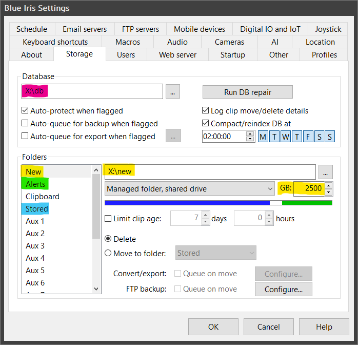

### Global Camera Settings

Ensure that **Hardware accelerated decode** (Intel Quick Sync) is enabled globally so Blue Iris can offload the processing to the integrated GPU.

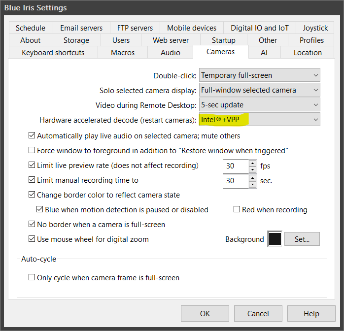

### CodeProject.AI Configuration

I use a specific set of custom models for accurate object detection:
`ipcam-animal`, `ipcam-combined`, `ipcam-dark`, `ipcam-general`, `ipcam-plate`, and `actionnetv2`.

To detect these specific entities, the following objects are defined in the AI settings:

  * **Persons:** `person,people`
  * **Vehicles:** `vehicle,car,DayPlate,NightPlate,bicycle,motorbike,bus,train,truck,boat`
  * **Wildlife:** `cat,dog,horse,sheep,cow,elephant,bear,zebra,giraffe,bird,deer,rabbit,raccoon,fox,skunk,squirrel`

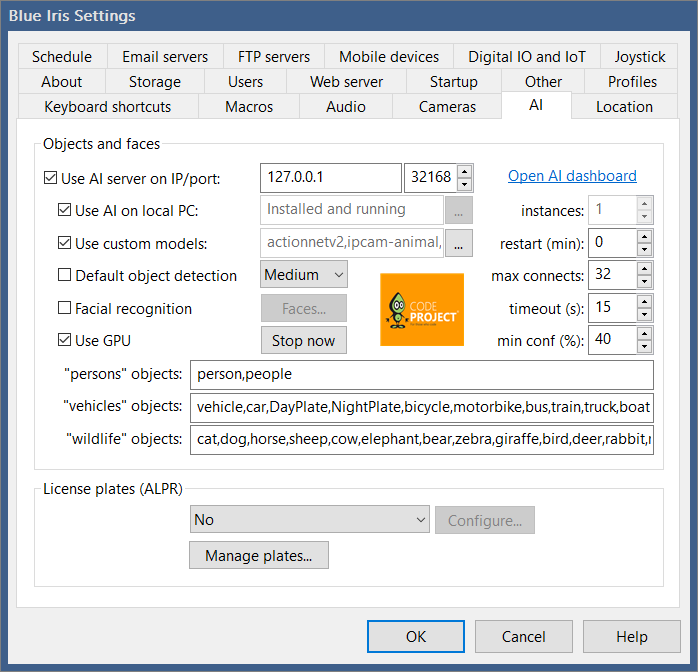

!!! note "License Plate Recognition"
    LPR (License Plate Recognition) is not currently configured, as the current camera angles do not provide the necessary trajectory to recognize plates accurately.

-----

## 2. Reolink Camera Configuration (On-Device)

Before adding the cameras to Blue Iris, log directly into the Reolink web interface to configure the network and streams. The strategy is to utilize two streams: a low-quality stream recorded constantly, and a high-quality stream triggered by AI movement.

**Stream Settings:**

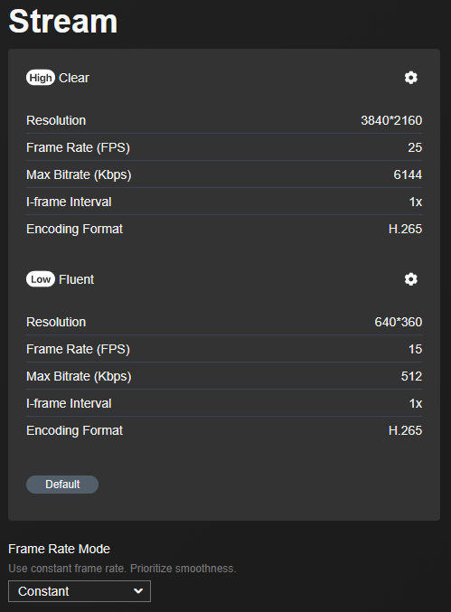

**Network Settings:**

  * Bind a **Static IP** to the camera.
  * Set a custom **NTP server** (allowed through OPNsense firewall rules) to keep timestamps perfectly synced.
  * Enable **RTSP** and **ONVIF** protocols.

-----

## 3. Camera Settings in Blue Iris

Once the camera is prepared, add it to Blue Iris:

**1. Connection & Orientation:** Connect to the Reolink IP, establish the streams, and configure the max framerate and camera orientation.

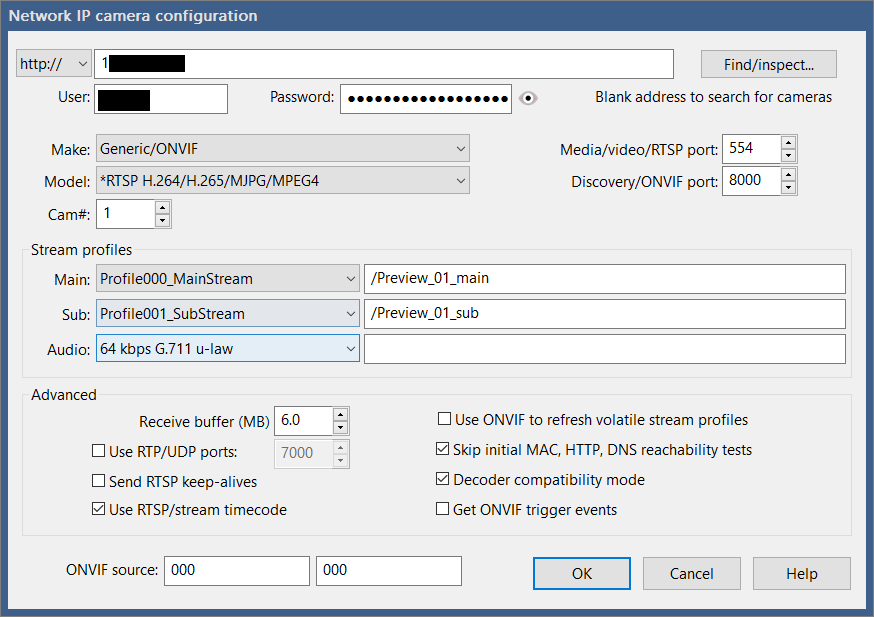
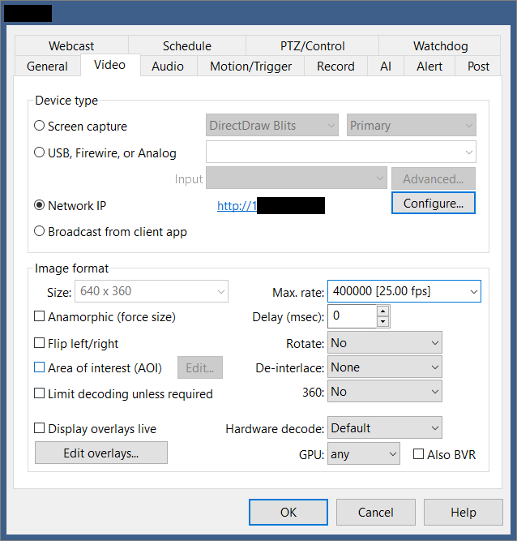

**2. Motion Sensor:** Configure the standard Blue Iris motion sensor parameters.

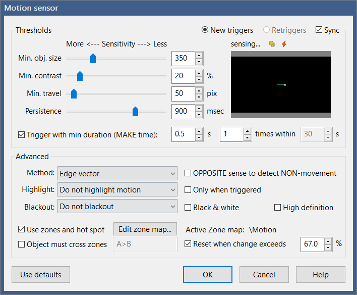

**3. Recording Format:** Set the recording mode to **Continuous sub + Alerts**. Ensure the format is set to **BVR** and record "Direct to disk" without any additional compression to save CPU cycles.

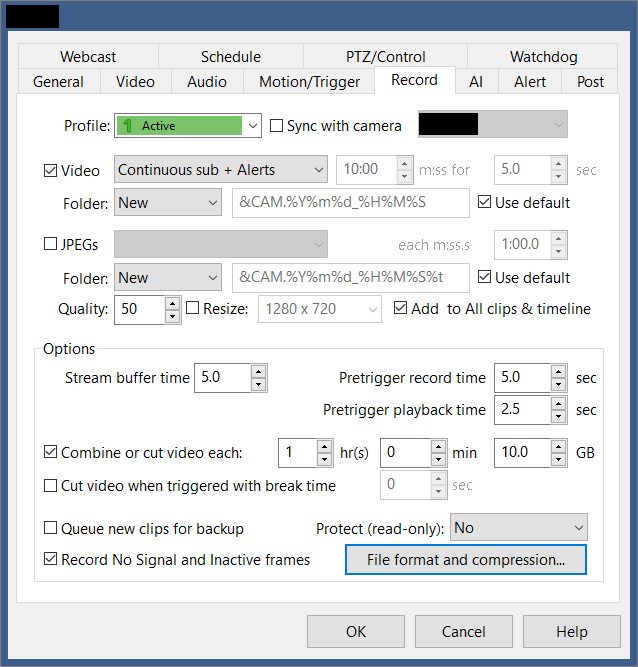
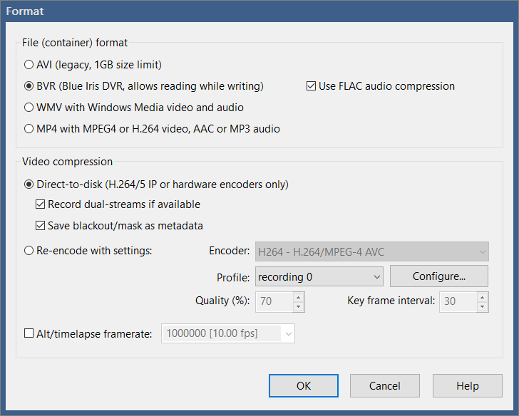

**4. AI Alerts & Motion Zones:** I primarily use the `ipcam-combined` model. Set the AI to confirm objects with over **65% confidence** (tweak this depending on your environment). Map out different motion zones to categorize alerts, and configure the camera to send notifications based on these specific zones.

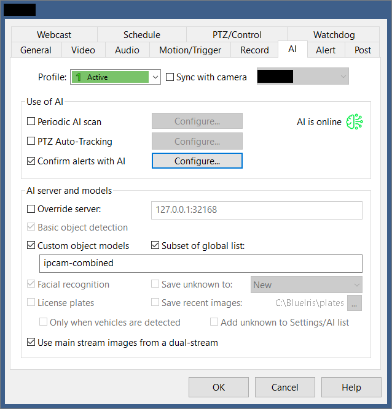
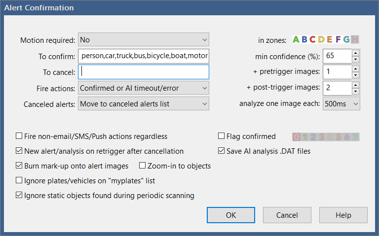

**5. Alert Actions:** Set up a trigger action to execute a local script that will push a notification to Signal.

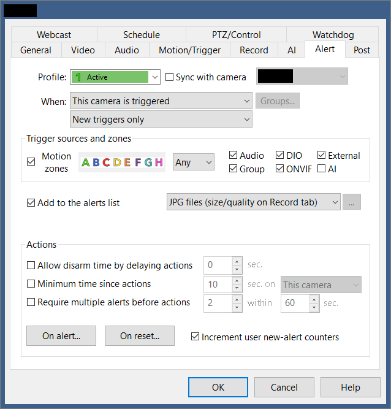
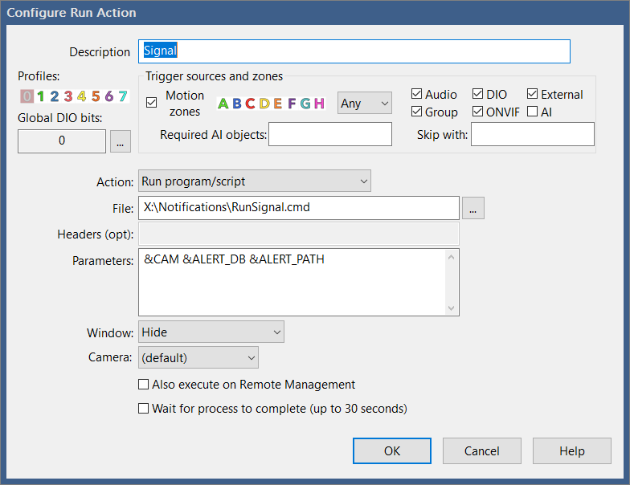

-----

## 4. Signal Messenger Notifications

Instead of relying on standard email or SMS, alerts are pushed directly to a Signal group containing a snapshot and a link to the recording.

This is handled by a Docker container running the **[Signal CLI REST API](https://github.com/bbernhard/signal-cli-rest-api)**.

!!! tip "Dedicated Signal Account"
    Follow the repository documentation to link the container to a Signal account. It is highly recommended to register a new, dedicated Signal phone number specifically for your homelab alerts.

### Notification Scripts

Blue Iris triggers a Batch file (`RunSignal.cmd`), which securely passes the variables to a PowerShell script (`Signal.ps1`) to handle the actual API payload.

**1. The Trigger Script:**
Save this as `RunSignal.cmd` in your Blue Iris scripts folder.

```bat title="RunSignal.cmd"
@echo off
setlocal

set "CAMERA_NAME=%1"
set "CLIP_LINK=%2"
set "PHOTO_PATH=%3"

powershell -ExecutionPolicy Bypass -File "Signal.ps1" -CAMERA_NAME "%CAMERA_NAME%" -CLIP_LINK "%CLIP_LINK%" -PHOTO_PATH "%PHOTO_PATH%"
```

**2. The Execution Script:**
Save this as `Signal.ps1`.

*Note: Ensure the `$PICFolder` variable matches the actual drive letter and path of your Blue Iris "alerts" folder and replace information that is contained in <>.*

```powershell title="Signal.ps1"
param(
    $CAMERA_NAME,
    $CLIP_LINK,
    $PHOTO_PATH
)

$PICFolder="X:\alerts"

$TMPFILE = [Convert]::ToBase64String([IO.File]::ReadAllBytes("$PICFolder\$PHOTO_PATH"))

$message = "Motion detected: $CAMERA_NAME https://<YOUR_BLUE_IRIS_URL>/ui3.htm?rec=$CLIP_LINK"
$number = "<YOUR_PHONE_NUMBER>"
$recipients="<YOUR_GROUP_ID>"

$json = @{
    "message"="$message"
    "base64_attachments" = @($TMPFILE)
    "number"="$number"
    "recipients"=@("$recipients")
} | ConvertTo-Json

Invoke-RestMethod -Uri "http://<YOUR_SINGAL_CLI_IP>/v2/send" -Method Post -ContentType 'application/json' -Body $json
```

### Bonus: Create a Signal Group via API

If you need to programmatically create the Signal group to hold these alerts, you can run this standalone PowerShell snippet:

```powershell title="CreateSignalGroup.ps1"
$recipients="<PHONE_NUMBER_YOU_WANT_TO_ADD>"

$json = @{
    "description"="Home Security Alerts"
    "group_link" = "disabled"
    "name"="NVR Alerts"
    "members"=@("$recipients")
} | ConvertTo-Json

Invoke-RestMethod -Uri "http://<YOUR_SINGAL_CLI_IP>/v1/groups/<YOUR_PHONE_NUMBER>" -Method POST -Header @{"Accept" = "application/json"} -ContentType 'application/json' -Body $json
```
