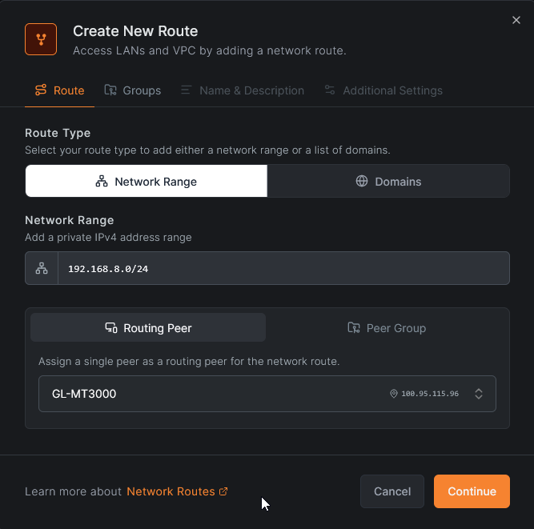
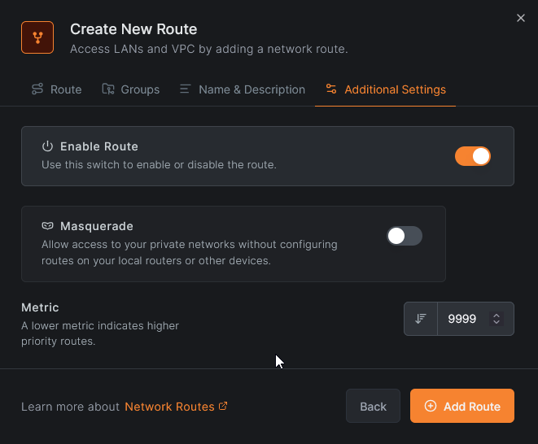
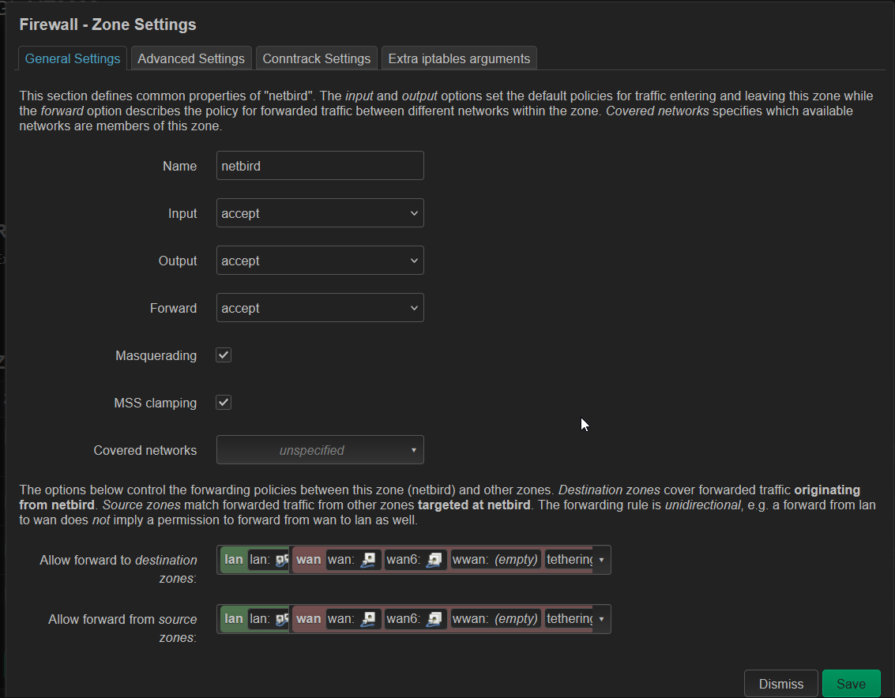
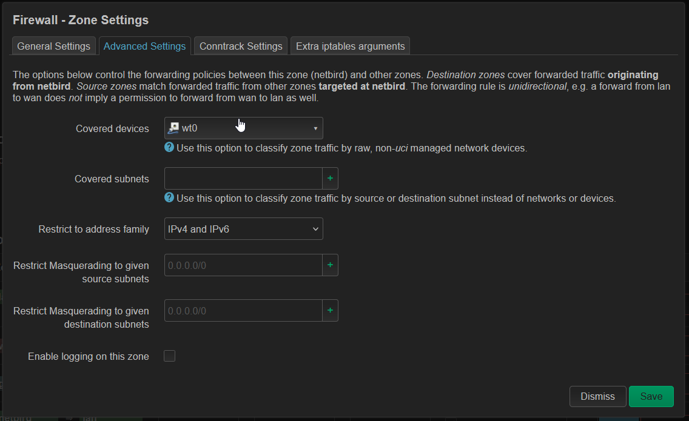
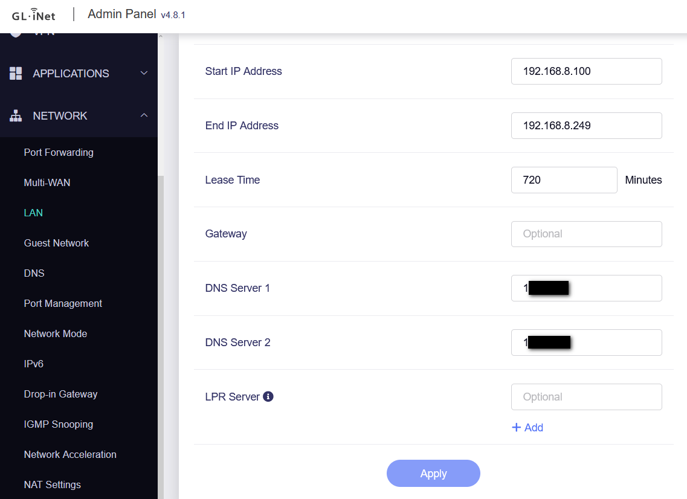
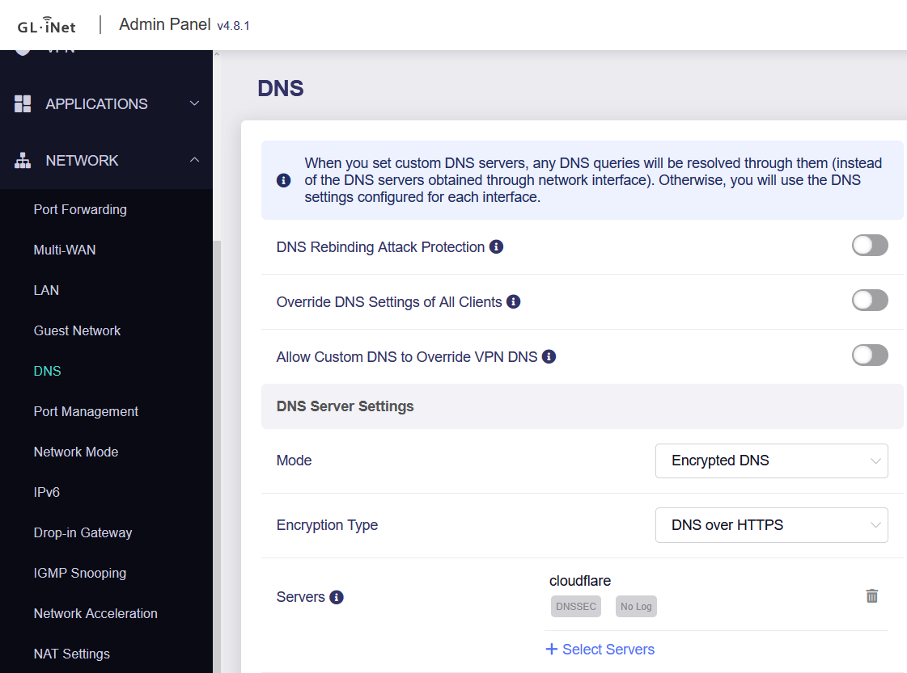

# Netbird VPN Deployment

This guide covers the deployment of a self-hosted Netbird management server within a Proxmox LXC container, configuring automatic updates, and connecting a GL.iNet MT-3000 travel router as a client.

!!! info "Infrastructure Note"
    For security purposes, the Netbird server is hosted on a Debian 12 LXC container placed in a separate VLAN (DMZ), as this container will be directly exposed to the internet.

---

## Part 1: Netbird Server Installation

### 1. Prerequisites

Before installing Netbird, ensure you have deployed a fresh Debian 12 container and configured the necessary port forwarding on your firewall.

**Port Forwarding Requirements:**

| Protocol | Ports | Purpose |
| --- | --- | --- |
| **TCP** | 80, 443 | HTTP/HTTPS (Let's Encrypt & Web UI) |
| **TCP** | 33073, 10000, 33080 | Netbird Management & Signal |
| **UDP** | 3478, 49152-65535 | Coturn (STUN/TURN) & WireGuard |

### 2. Install Required Packages

Update your system and install the base dependencies:

```bash
apt update && apt upgrade -y
apt install sudo jq curl -y

```

### 3. Install Docker Engine

Netbird and its dependencies (like Zitadel) run in Docker. Install Docker using the official repository:

```bash
# Add Docker's official GPG key:
sudo apt-get update
sudo apt-get install ca-certificates curl
sudo install -m 0755 -d /etc/apt/keyrings
sudo curl -fsSL https://download.docker.com/linux/debian/gpg -o /etc/apt/keyrings/docker.asc
sudo chmod a+r /etc/apt/keyrings/docker.asc

# Add the repository to Apt sources:
echo \
  "deb [arch=$(dpkg --print-architecture) signed-by=/etc/apt/keyrings/docker.asc] https://download.docker.com/linux/debian \
  $(. /etc/os-release && echo "$VERSION_CODENAME") stable" | \
  sudo tee /etc/apt/sources.list.d/docker.list > /dev/null

# Install Docker components:
sudo apt-get update
sudo apt-get install docker-ce docker-ce-cli containerd.io docker-buildx-plugin docker-compose-plugin -y

```

### 4. Run the Netbird Installation Script

!!! warning "DNS Requirement"
    Before running the script below, you **must** configure your domain's DNS records to point to your public IP address. The script relies on this to automatically generate SSL certificates.

Replace `<YOUR_DOMAIN_NAME>` with your actual domain and execute the setup script:

```bash
export NETBIRD_DOMAIN=<YOUR_DOMAIN_NAME>
curl -fsSL https://github.com/netbirdio/netbird/releases/latest/download/getting-started-with-zitadel.sh | bash

```

---

## Part 2: Automatic Netbird Updates

To keep the Netbird infrastructure secure and up to date, we will configure a cron job to run an automated update script.

1. Navigate to your user's home directory:
```bash
cd ~

```
2. Download the update script:
```bash
wget https://raw.githubusercontent.com/adminakademia/aplikacje_kontenerowe/refs/heads/main/zarzadzanie_siecia_LAN/netbird_upgrade_backup/netbird_upgrade.sh

```
3. Open the downloaded script in a text editor and update the file paths to match your Netbird installation directory.
4. Make the script executable:
```bash
chmod 700 ./netbird_upgrade.sh

```
5. Add the script to your crontab. Open the cron editor using `crontab -e` and add the following line to run the update every Saturday at 8:00 AM (replace `<USERNAME>` with your actual username):
```text
0 8 * * 6 /home/<USERNAME>/netbird_upgrade.sh >> /home/<USERNAME>/netbird_cron.log 2>&1

```
??? info "Script Source"
    This script is sourced from the [AdminAkademia GitHub Repository](https://github.com/adminakademia/aplikacje_kontenerowe/blob/main/zarzadzanie_siecia_LAN/netbird_upgrade_backup/netbird_upgrade.sh).
    
---

## Part 3: GL.iNet MT-3000 Client Setup

Follow these steps to install and route traffic through Netbird on a GL.iNet MT-3000 (OpenWrt) router.

### 1. Install and Start the Netbird Client

Connect to your router via SSH and run the following commands:

```bash
opkg update
opkg install netbird

/etc/init.d/netbird enable
/etc/init.d/netbird start

```

### 2. Authenticate the Router

Log the router into your Netbird network using a setup key generated from your Netbird dashboard:

```bash
netbird login --setup-key <SETUP_KEY>

```

### 3. Configure Route

Log into the Netbird interface to add a new route for the GL.iNet:



### 4. Configure the Firewall Zone (LuCI)

Navigate to the advanced LuCI interface to add new firewall zone:



### 5. DNS Configuration (Optional)

If you want to use local DNS over the Netbird tunnel:

1. Set your local DNS nameservers in the DHCP settings.

2. Use a public DNS provider as your upstream DNS to reliably resolve your Netbird server's public domain name.

