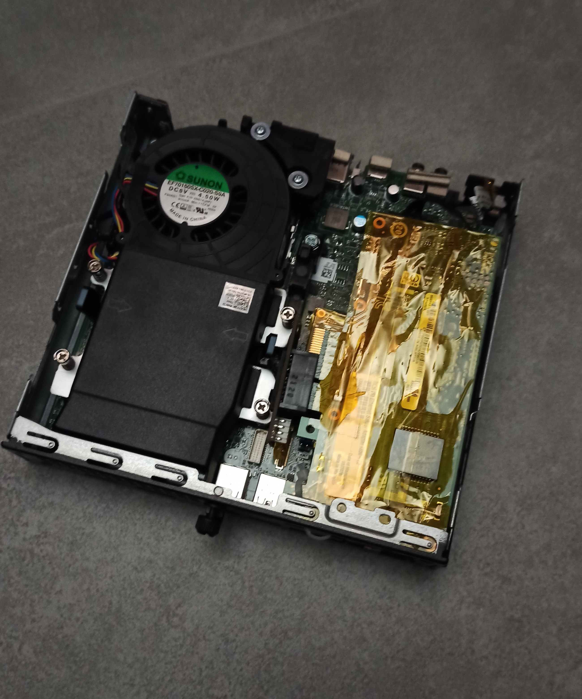
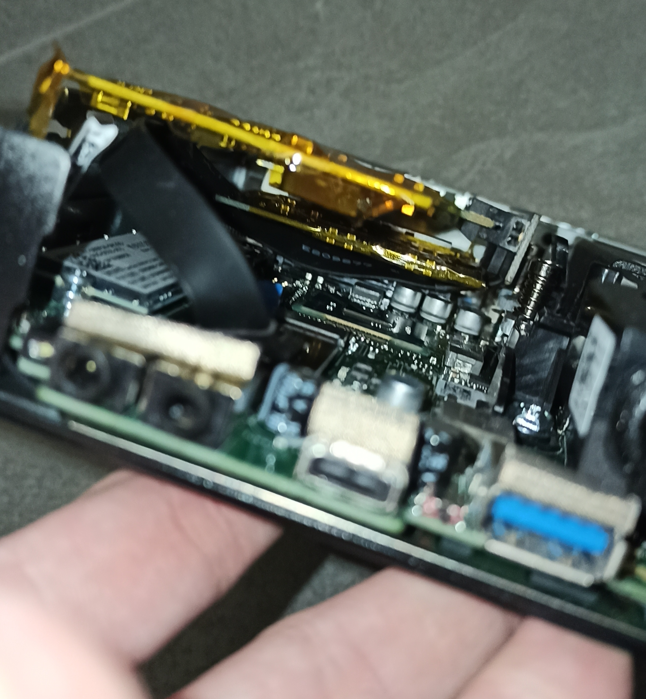
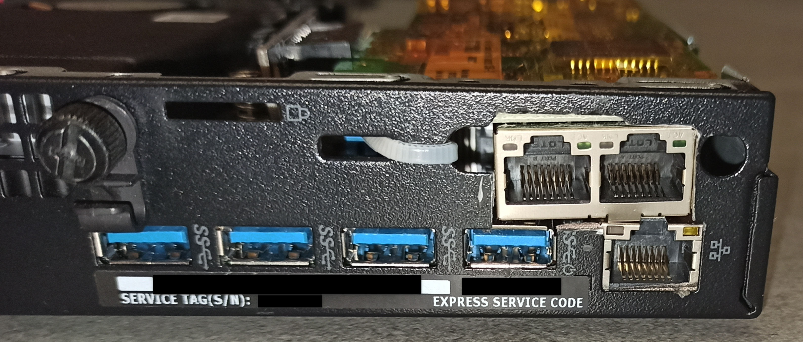
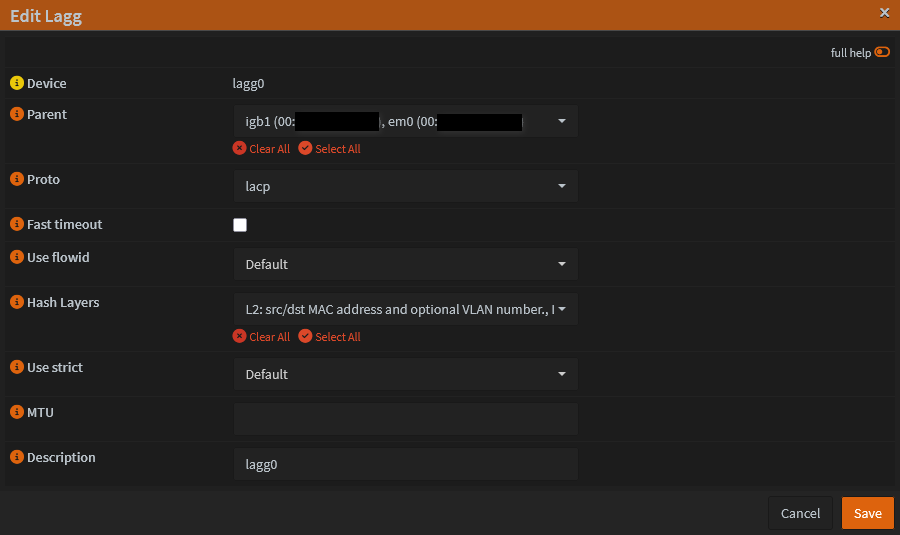
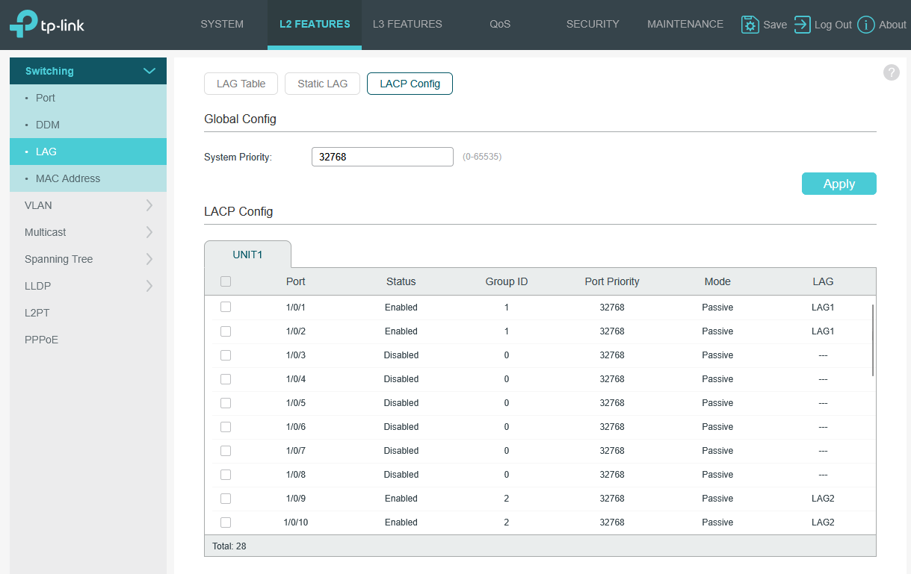
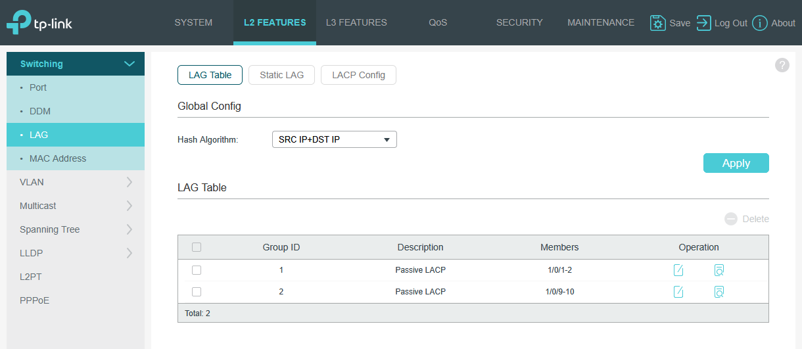
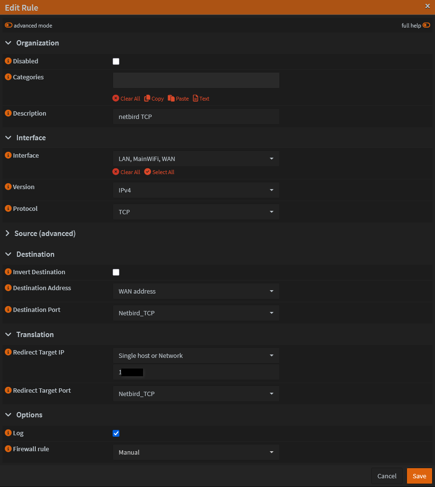
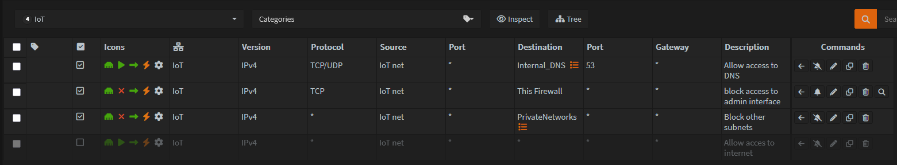

# OPNsense Firewall Deployment

This page documents the hardware modification, installation, and configuration of the core network firewall and router using OPNsense.

## 1. Hardware & Modifications

The firewall runs on a modified **Dell Optiplex 7050 Micro**. Because micro-form-factor PCs typically lack PCIe expansion slots, hardware modifications were necessary to add the required network interfaces.

  * **Network Expansion:** Used an M.2 to PCIe adapter to connect an additional network card I had on hand. I carefully cut a slot in the back chassis to accommodate the new ports.
  * **Storage / Redundancy:** Installed two SSDs configured in a **ZFS Mirror** during the OPNsense installation process to ensure high availability and protect against drive failure.

**Modification Gallery:**

-----

## 2. Network Interfaces & LAGG

The system has a total of three 1Gbps network interfaces. To maximize bandwidth and provide redundancy to the core switch, the LAN side is configured using Link Aggregation (LAGG).

  * **WAN:** 1x 1Gbps Interface
  * **LAN:** 2x 1Gbps Interfaces bonded in a LAGG

### LAGG Configuration

The LAGG is configured using LACP to connect to the core managed switch.

  * **Selected Interfaces:** `igb0`, `em0`
  * **Protocol:** LACP
  * **Hash Layers:** L2 and L3

-----

## 3. VLAN Segmentation

To ensure security and isolate broadcast traffic, the network is segmented into the following VLANs, all routed through OPNsense:

  * **Trusted Devices:** Primary network for personal PCs.
  * **Main WiFi:** Standard wireless access.
  * **IoT (Internet of Things):** Isolated network for smart home devices.
  * **CCTV:** Completely locked-down network for IP cameras.
  * **DMZ:** Demilitarized zone for externally exposed services (e.g., Netbird container).

-----

## 4. DNS & DHCP Configuration

### Primary DNS (AdGuard Home)

To manage network-wide ad blocking, tracking protection, and custom DNS filtering, the `os-adguardhome-maxit` plugin is utilized. AdGuard Home serves as the primary, authoritative DNS server for all VLANs.

!!! info "AdGuard Home"
    **For detailed configuration, blocklists, and DNS routing rules, refer to the [AdGuard Home](AdGuard Home.md) documentation page.**

### DHCP Server (Dnsmasq)

For IP address assignment and management across the various VLANs, OPNsense is configured to use **Dnsmasq** as the DHCP server. It handles standard dynamic IP leases for client devices, as well as serving static IP mappings for core homelab infrastructure and servers.

-----

## 5. Firewall Rules & Port Forwarding

### Netbird DMZ Port Forwarding

To route external traffic to the Netbird server located in the DMZ, specific ports are forwarded. To keep the configuration clean, an **Alias** was created containing all required Netbird ports, which is then applied to a single NAT Port Forward rule.

Example rule:

!!! tip "NAT Reflection"
    **NAT Reflection** is enabled globally. This allows internal devices on the LAN to access internally hosted services using their external public IP/Domain name seamlessly without leaving the local network.

### IoT VLAN Rules Example

The IoT network is strictly controlled to prevent compromised smart devices from pivoting into the trusted network.

**IoT Rule Order:**

1.  **Allow DNS:** Permit traffic to the local DNS server.
2.  **Block Access to Firewall:** Prevent access to the OPNsense web GUI and SSH.
3.  **Block Inter-VLAN Routing:** Prevent access to all other local subnets (Trusted, Management, etc.).
4.  **Internet Access:** The default "Allow All" internet rule is strictly **disabled** (or conditionally enabled only for specific devices that require cloud access).

-----

## 6. Services & Plugins

The following official and community plugins are installed to extend the firewall's capabilities:

  * `os-adguardhome-maxit` (DNS filtering and ad-blocking)
  * `os-crowdsec` (Collaborative IPS/threat defense)
  * `os-ddclient` (Dynamic DNS updating)
  * `os-dmidecode` (Hardware info reporting)
  * `os-gdrive-backup` (Automated cloud backups)
  * `os-mdns-repeater` (Multicast DNS across subnets)
  * `os-vnstat` (Bandwidth monitoring)
  * `os-wol` (Wake-on-LAN functionality)
  * `os-smart` (SSD/HDD health monitoring)

### Service Highlights

#### CrowdSec Intrusion Prevention (IPS)

The `os-crowdsec` plugin provides a collaborative, community-driven Intrusion Prevention System. It actively monitors OPNsense logs and leverages the CrowdSec network to automatically identify and drop malicious traffic. The integrated **Firewall Bouncer** is configured to block known malicious IPs attempting to scan, probe, or brute-force the WAN interface and exposed DMZ services.

#### Dynamic DNS (Cloudflare)

`os-ddclient` is configured to automatically update the public IP address via the Cloudflare API whenever the ISP changes the WAN IP, ensuring external services remain reachable.

#### mDNS Repeater

Configured to listen across the **Main WiFi** and **IoT** networks. This allows trusted devices (like phones) to discover and control IoT devices (like Chromecasts or smart speakers) seamlessly across VLAN boundaries.

#### Automated Cloud Backups

To protect the complex firewall configuration, the `os-gdrive-backup` plugin is configured. OPNsense automatically encrypts and uploads its configuration XML to a secure Google Drive folder on a scheduled basis.

## 7. Remote Access & VPNs

To ensure reliable and redundant access to my homelab from the outside world, I maintain two separate VPN services. My primary mesh VPN is Netbird, but I also run a traditional OpenVPN server directly on the OPNsense firewall as a robust, router-level fallback.

!!! info "Netbird"
    **For detailed configuration, refer to the [Netbird](Netbird.md) documentation page.**

-----

### OpenVPN (OPNsense Failover)

While Netbird handles my primary peer-to-peer routing and is hosted in the DMZ, OpenVPN serves as my "break-glass" remote access method. Because it runs directly on the core OPNsense hardware, it guarantees I can still securely access my management interfaces to troubleshoot the network even if the Netbird container, Proxmox host, or DMZ VLAN goes offline.

#### 1. Certificate Authority & Keys

Before setting up the server, the cryptographic trust chain was established in OPNsense under **System > Trust > Certificates**.

  * Generated a new internal Certificate Authority (CA).
  * Generated a new Server Certificate signed by the CA.
  * **Key Parameters:** RSA 2048-bit, SHA-256 Hash Algorithm.

#### 2. OpenVPN Server Configuration

The core server was configured under **VPN > OpenVPN > Instances** using the following parameters:

  * **Protocol:** UDP
  * **Local Port:** 1194
  * **Device Mode:** TUN
  * **Cryptography:** Attached the previously generated server certificate and enabled strict certificate verification.
  * **Network Settings:** Assigned a dedicated VPN tunnel subnet and pushed the local DNS servers (AdGuard Home) to connected clients so local hostnames resolve correctly over the tunnel.

#### 3. Firewall Rules for OpenVPN

To allow the VPN to function, two sets of firewall rules were created:

1.  **WAN Interface:** Created a rule allowing incoming UDP traffic on port 1194 to permit clients to initiate the connection to the firewall from the outside.
2.  **OpenVPN Interface:** Created rules to allow traffic originating from the VPN tunnel to access the required local VLANs.

#### 4. User Creation & Client Export

To grant access to specific devices:

1.  Navigated to **System > Access > Users** and created dedicated OPNsense user accounts.
2.  Generated a unique client certificate for each user during the account creation process.
3.  Utilized the **Client Export** utility to easily download the fully assembled `.ovpn` configuration profiles for deployment on laptops and mobile phones.
