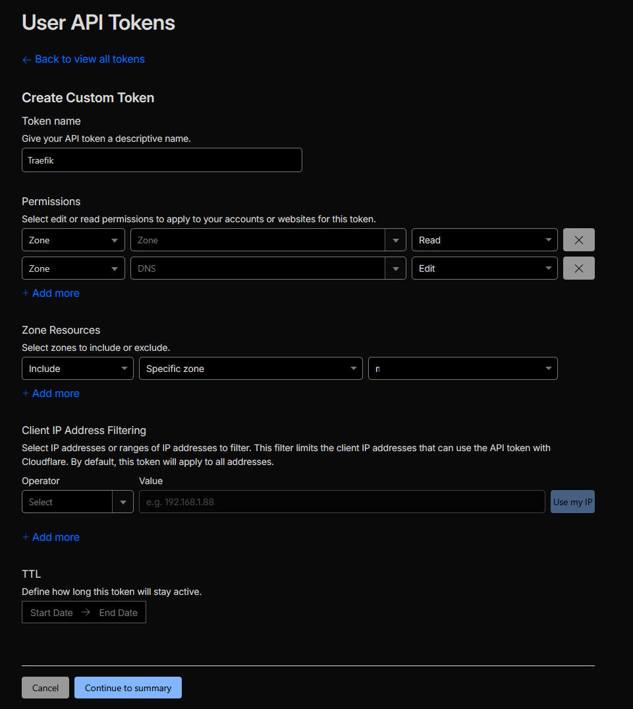

# Traefik Reverse Proxy with Cloudflare SSL

This guide covers setting up **Traefik v3** as a reverse proxy in a Docker LXC Debian container. This deployment utilizes the Cloudflare DNS-01 challenge, allowing you to generate valid Let's Encrypt wildcard SSL certificates without exposing port 80 to the public internet.

!!! info "Infrastructure Note"
    This setup is deployed on a standard Debian LXC container running Docker, cloned from a base template.

### Prerequisites

  * A registered domain name.
  * Domain DNS managed by Cloudflare.

-----

## 1. Prepare Cloudflare API Token

Traefik needs to communicate with Cloudflare to verify domain ownership. We need to generate a scoped API token for this.

1.  Log in to Cloudflare and navigate to **My Profile** \> **API Tokens**.
2.  Create a new **Custom Token** with the necessary DNS edit permissions:


!!! danger "Secure Your Token"
    Once generated, copy your API key into a secure password manager immediately. Cloudflare will only display this token **once**.

-----

## 2. System Preparation & Secrets

First, install the necessary utilities, create the Docker network, and set up the directory structure.

**Install Apache Utils (Required for password generation):**

```bash
sudo apt update
sudo apt install apache2-utils -y
```

**Create the Docker Network:**
Traefik needs an external Docker network to route traffic to other containers.

```bash
docker network create proxy
```

**Set up Directories and Secrets:**

```bash
mkdir -p traefik/data
cd traefik

# Save your Cloudflare API token
nano cf_api_token.txt
# (Paste your token, save, and exit)
```

-----

## 3. Generate Dashboard Credentials

To secure the Traefik dashboard, we need to generate basic HTTP authentication credentials.

Replace `<USERNAME>` with your desired admin username and run the following command. It will prompt you for a password and format it correctly for Docker Compose:

```bash
echo $(htpasswd -nB <USERNAME>) | sed -e s/\\$/\\$\\$/g
```

Copy the output string. Now, create your environment variables file:

```bash
nano .env
```

Paste your generated credentials into the file like this:

```env title=".env"
TRAEFIK_DASHBOARD_CREDENTIALS=your_generated_string_here
```

-----

## 4. Traefik Configuration Files

Traefik relies on two main configuration files: a static config (`traefik.yml`) and a dynamic config (`config.yml`). We also need to create an empty, secured file for the SSL certificates.

### SSL Certificate Storage

Create the `acme.json` file and lock down its permissions. Traefik will refuse to start if this file is too open.

```bash
touch data/acme.json
chmod 600 data/acme.json
```

### Static Configuration

Create the `traefik.yml` file. Be sure to replace `<YOUR_CLOUDFLARE_EMAIL>` with your actual account email.

```yaml title="data/traefik.yml"
api:
  dashboard: true
  disableDashboardAd: true
  debug: true

entryPoints:
  http:
    address: ":80"
    http:
      redirections:
        entryPoint:
          to: https
          scheme: https
  https:
    address: ":443"

serversTransport:
  insecureSkipVerify: true

providers:
  docker:
    endpoint: "unix:///var/run/docker.sock"
    exposedByDefault: false
  file:
    filename: /config.yml

certificatesResolvers:
  cloudflare:
    acme:
      email: <YOUR_CLOUDFLARE_EMAIL>
      storage: acme.json
      caServer: https://acme-v02.api.letsencrypt.org/directory # prod (default)
      # caServer: https://acme-staging-v02.api.letsencrypt.org/directory # test
      dnsChallenge:
        provider: cloudflare
        # disablePropagationCheck: true 
        # delayBeforeCheck: 60s 
        resolvers:
          - "1.1.1.1:53"
          - "1.0.0.1:53"
```

### Dynamic Configuration (External Routes)

Create the `config.yml` file. This file defines external routes to services not running in Docker (e.g., TrueNAS, Proxmox GUI). To add more services later, just copy and paste the router/service blocks.

```yaml title="data/config.yml"
http:
 #region routers
  routers:
    <NAME>:
      entryPoints:
        - "https"
      rule: "Host(`<SUBDOMAIN_NAME>.<YOUR_DOMAIN>`)"
      middlewares:
        - default-headers
        - https-redirectscheme
      tls: {}
      service: <SERVICE_NAME>
 #endregion

 #region services
  services:
    <SERVICE_NAME>:
      loadBalancer:
        servers:
          - url: "https://<IP_WITH_PORT>"
        passHostHeader: true
 #endregion

  middlewares:
    https-redirectscheme:
      redirectScheme:
        scheme: https
        permanent: true

    default-headers:
      headers:
        frameDeny: true              # set to false to enable embedding
        browserXssFilter: true
        contentTypeNosniff: true
        forceSTSHeader: true
        stsIncludeSubdomains: true
        stsPreload: true
        stsSeconds: 15552000
        customFrameOptionsValue: SAMEORIGIN     # set "ALLOW-FROM https://<BASE_URL>" to enable embedding
        customRequestHeaders:
          X-Forwarded-Proto: https

    default-whitelist:
      ipAllowList:
        sourceRange:
        - "10.0.0.0/8"
        - "192.168.0.0/16"
        - "172.16.0.0/12"

    secured:
      chain:
        middlewares:
        - default-whitelist
        - default-headers
```

-----

## 5. Docker Compose Deployment

Finally, create the Docker Compose file to tie everything together. Remember to replace `<YOUR_DOMAIN>` with your actual domain name.

```yaml title="docker-compose.yaml"
services:
  traefik:
    image: traefik:v3.0
    container_name: traefik
    restart: unless-stopped
    security_opt:
      - no-new-privileges:true
    networks:
      - proxy
    ports:
      - 80:80
      - 443:443
      # - 443:443/tcp # Uncomment if you want HTTP3
      # - 443:443/udp # Uncomment if you want HTTP3
    environment:
      CF_DNS_API_TOKEN_FILE: /run/secrets/cf_api_token
      TRAEFIK_DASHBOARD_CREDENTIALS: ${TRAEFIK_DASHBOARD_CREDENTIALS}
    secrets:
      - cf_api_token
    env_file: .env
    volumes:
      - /etc/localtime:/etc/localtime:ro
      - /var/run/docker.sock:/var/run/docker.sock:ro
      - ./data/traefik.yml:/traefik.yml:ro
      - ./data/acme.json:/acme.json
      - ./data/config.yml:/config.yml:ro
    labels:
      - "traefik.enable=true"
      - "traefik.http.routers.traefik.entrypoints=http"
      - "traefik.http.routers.traefik.rule=Host(`traefik-dashboard.<YOUR_DOMAIN>`)"
      - "traefik.http.middlewares.traefik-auth.basicauth.users=${TRAEFIK_DASHBOARD_CREDENTIALS}"
      - "traefik.http.middlewares.traefik-https-redirect.redirectscheme.scheme=https"
      - "traefik.http.middlewares.sslheader.headers.customrequestheaders.X-Forwarded-Proto=https"
      - "traefik.http.routers.traefik.middlewares=traefik-https-redirect"
      - "traefik.http.routers.traefik-secure.entrypoints=https"
      - "traefik.http.routers.traefik-secure.rule=Host(`traefik-dashboard.<YOUR_DOMAIN>`)"
      - "traefik.http.routers.traefik-secure.middlewares=traefik-auth"
      - "traefik.http.routers.traefik-secure.tls=true"
      - "traefik.http.routers.traefik-secure.tls.certresolver=cloudflare"
      - "traefik.http.routers.traefik-secure.tls.domains[0].main=<YOUR_DOMAIN>"
      - "traefik.http.routers.traefik-secure.tls.domains[0].sans=*.<YOUR_DOMAIN>"
      - "traefik.http.routers.traefik-secure.service=api@internal"

secrets:
  cf_api_token:
    file: ./cf_api_token.txt

networks:
  proxy:
    external: true
```

## 6. Launch Traefik

Spin up the container in detached mode:

```bash
docker compose up -d
```

!!! success "Next Step: DNS Records"
    Now that Traefik is running, log into your local DNS server (e.g., Pi-hole, AdGuard, or your router) and create a DNS rewrite to point `traefik-dashboard.<YOUR_DOMAIN>` and all future subdomains to the IP address of your Traefik LXC container.
